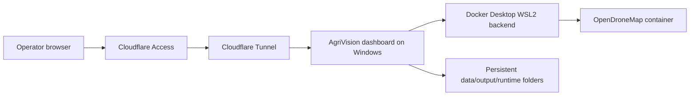

# Windows Self-Hosting

This setup turns one Windows workstation into a private AgriVision host. Operators use the dashboard through a browser, while Docker Desktop runs the pipeline containers locally on the machine.

Use this path for a trusted farm deployment where a Windows workstation remains powered on and protected by Cloudflare Access.

## Runtime Model



## Windows Host Requirements

- Windows 10/11 with WSL2 support
- Docker Desktop configured with the WSL2 backend
- 32 GB RAM recommended for ODM workloads
- At least 100 GB free disk space for active projects
- Sleep disabled while processing
- Project data stored on an internal SSD when possible

In Docker Desktop, increase resources before long ODM runs:

- Memory: 16 GB minimum, 24 GB or more recommended
- CPUs: at least 6 if available
- Disk image size: leave enough room for ODM intermediate files

## Application Settings

Set these values in `.env` or as environment variables on the host:

```env
AGRIVISION_DEPLOYMENT_MODE=self_hosted
AGRIVISION_PUBLIC_URL=https://agrivision.example.com
AGRIVISION_MIN_FREE_DISK_GB=50
AGRIVISION_MAX_ACTIVE_ODM_RUNS=1
AGRIVISION_EXTERNAL_ACCESS_PROTECTION_CONFIRMED=false
```

`AGRIVISION_MAX_ACTIVE_ODM_RUNS=1` is intentional for Windows self-hosting. ODM is CPU, memory, and disk intensive, so parallel orthophoto generation can make both runs fail.

`AGRIVISION_MIN_FREE_DISK_GB` is checked before ODM starts. Increase it for large drone datasets.

## Confirm Local Access

Open the local dashboard first:

```text
http://localhost:8008
```

Fix local startup problems before adding Cloudflare. The tunnel should only expose a dashboard that already works locally.

## Cloudflare Tunnel

Cloudflare Tunnel is the recommended way to expose a Windows-hosted dashboard because it uses outbound connections from the host to Cloudflare. Do not open inbound router ports for the dashboard.

First prove the app works locally:

```powershell
docker compose ps agrivision
Invoke-WebRequest -Uri http://localhost:8008 -UseBasicParsing
```

Only continue when `http://localhost:8008` returns the dashboard.

### Temporary Quick Tunnel

Use a quick tunnel for demos or first validation before buying or configuring a domain:

```powershell
docker run --rm cloudflare/cloudflared:latest tunnel --url http://host.docker.internal:8008
```

Cloudflare prints a temporary URL similar to:

```text
https://random-words.trycloudflare.com
```

Open that URL and confirm the AgriVision dashboard loads. This URL is public while the command is running. Use it only for short validation.

If running the quick tunnel in detached mode:

```powershell
docker run -d --name agrivision-quick-tunnel cloudflare/cloudflared:latest tunnel --no-autoupdate --url http://host.docker.internal:8008
docker logs agrivision-quick-tunnel
```

Stop it when testing is complete:

```powershell
docker rm -f agrivision-quick-tunnel
```

### Permanent Named Tunnel

For a stable farmer-facing URL, the organization needs a real registered domain that is active in Cloudflare DNS. A Zero Trust tunnel route alone is not enough; the hostname must resolve publicly.

If the organization does not yet have a domain, buy/register one and add it to Cloudflare before continuing.

After the domain is registered and added to Cloudflare, create a named tunnel in the Cloudflare Zero Trust dashboard:

- **Zero Trust > Networks > Tunnels**
- Create a tunnel, for example `agrivision-windows-pc`
- Choose Docker or `cloudflared` as the connector
- Run the connector command on the Windows host

For a Docker connector, Cloudflare provides a token command similar to:

```powershell
docker run cloudflare/cloudflared:latest tunnel --no-autoupdate run --token <TOKEN>
```

The connector must remain running for the public URL to work. Verify it locally:

```powershell
docker ps --filter "ancestor=cloudflare/cloudflared:latest"
```

Add a published application route:

```text
Subdomain: agrivision
Domain: example.com
Path: empty, or ^/.* if the UI requires a value
Type: HTTP
URL: host.docker.internal:8008
```

The resulting public URL is:

```text
https://agrivision.example.com
```

If `cloudflared` is installed directly as a Windows service instead of running inside Docker, use `localhost:8008` as the service URL. If `cloudflared` runs inside Docker, use `host.docker.internal:8008`.

If the hostname returns Cloudflare 404, check that:

- the domain is registered and active in Cloudflare
- DNS has a CNAME for the subdomain pointing to `<tunnel-id>.cfargotunnel.com`
- the published route path is empty or `^/.*`
- the connector status is healthy

If the public URL returns FastAPI `{"detail":"Not Found"}`, the tunnel is reaching the app but forwarding an unexpected path. Open the root URL with a trailing slash:

```text
https://agrivision.example.com/
```

## Access Control

Do not expose the dashboard directly to the internet. Put Cloudflare Access in front of the tunnel and restrict access to known user emails or an organization identity provider.

Recommended controls:

- require Cloudflare Access login
- avoid opening inbound firewall ports for the dashboard
- keep the dashboard bound to localhost where possible
- rotate API keys in `.env` if a workstation is shared

After Cloudflare Access is enabled and tested, mark **Cloudflare Access or equivalent external login is enabled** in the dashboard Deployment settings. Until that is marked, AgriVision keeps the deployment checklist in a warning state.

## Persistence and Backup

Back up these folders:

- `data/uploads/`
- `output/`
- `runtime/`
- `.env`
- `config.yaml`

Do not back up temporary ODM working folders while runs are active. Stop the dashboard or wait for all runs to complete first.

## Operational Checks

Before giving the URL to users:

```powershell
docker compose ps
docker compose logs --tail 100
docker system df
```

In the dashboard, run a small orthophoto job before a full dataset. Confirm that the report opens and the saved orthophoto appears in the orthophoto list.
