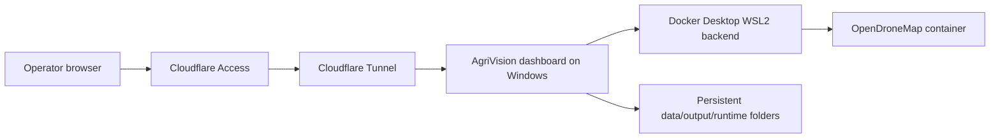

# Windows Self-Hosting

This setup turns one Windows workstation into a private AgriVision host. Operators use the dashboard through a browser, while Docker Desktop runs the pipeline containers locally on the machine.

Use this path for a small trusted deployment. For public or multi-tenant production, use a managed Linux server with normal backup, monitoring, and access-control operations.

## Runtime Model



## Windows Host Requirements

- Windows 10/11 with WSL2 support
- Docker Desktop configured with the WSL2 backend
- 32 GB RAM recommended for ODM workloads
- At least 100 GB free disk space for active projects
- Sleep disabled while processing
- Project data stored on an internal SSD when possible

In Docker Desktop, increase resources before long ODM runs:

- Memory: 16 GB minimum, 24 GB or more recommended
- CPUs: at least 6 if available
- Disk image size: leave enough room for ODM intermediate files

## Application Settings

Set these values in `.env` or as environment variables on the host:

```env
AGRIVISION_DEPLOYMENT_MODE=self_hosted
AGRIVISION_PUBLIC_URL=https://agrivision.example.com
AGRIVISION_MIN_FREE_DISK_GB=50
AGRIVISION_MAX_ACTIVE_ODM_RUNS=1
```

`AGRIVISION_MAX_ACTIVE_ODM_RUNS=1` is intentional for Windows self-hosting. ODM is CPU, memory, and disk intensive, so parallel orthophoto generation can make both runs fail.

`AGRIVISION_MIN_FREE_DISK_GB` is checked before ODM starts. Increase it for large drone datasets.

## Run Locally First

From the repository root:

```powershell
docker compose build
docker compose up -d
docker compose ps
```

Open the local dashboard first:

```text
http://localhost:8008
```

Fix local startup problems before adding Cloudflare. The tunnel should only expose a dashboard that already works locally.

## Cloudflare Tunnel

Install `cloudflared`, then authenticate it:

```powershell
cloudflared tunnel login
cloudflared tunnel create agrivision
cloudflared tunnel route dns agrivision agrivision.example.com
```

Create a Cloudflare tunnel config pointing to the local dashboard:

```yaml
tunnel: agrivision
credentials-file: C:\Users\<user>\.cloudflared\<tunnel-id>.json

ingress:
  - hostname: agrivision.example.com
    service: http://localhost:8008
  - service: http_status:404
```

Run it interactively for the first test:

```powershell
cloudflared tunnel run agrivision
```

After the URL works, install it as a Windows service:

```powershell
cloudflared service install
```

## Access Control

Do not expose the dashboard directly to the internet. Put Cloudflare Access in front of the tunnel and restrict access to known user emails or an organization identity provider.

Recommended controls:

- require Cloudflare Access login
- avoid opening inbound firewall ports for the dashboard
- keep the dashboard bound to localhost where possible
- rotate API keys in `.env` if a workstation is shared

## Persistence and Backup

Back up these folders:

- `data/uploads/`
- `output/`
- `runtime/`
- `.env`
- `config.yaml`

Do not back up temporary ODM working folders while runs are active. Stop the dashboard or wait for all runs to complete first.

## Operational Checks

Before giving the URL to users:

```powershell
docker compose ps
docker compose logs --tail 100
docker system df
```

In the dashboard, run a small orthophoto job before a full dataset. Confirm that the report opens and the saved orthophoto appears in the orthophoto list.
